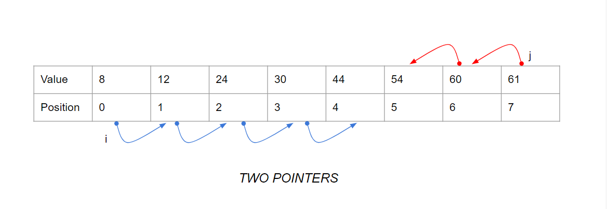
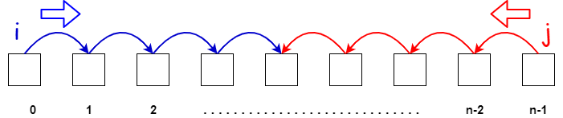
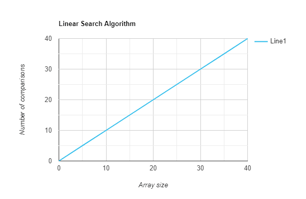

# Two Pointers Algorithm 

## Introduction
The Two Pointers Algorithm is a technique used to efficiently solve problems with a linear data structure, such as arrays or linked lists. It involves iterating through the data structure with two pointers (indexes) that move towards each other or in some specific manner, allowing for an optimized solution to certain types of problems.

## Algorithm Description
The algorithm typically involves initializing two pointers, often named "left" and "right," and moving them based on certain conditions until they meet or fulfill a specific criterion. This approach helps in solving problems that require examining pairs of elements or subarrays efficiently.

### Example 
(https://leetcode.com/problems/remove-duplicates-from-sorted-array/description/)
/*
Given an integer array nums sorted in non-decreasing order, remove the duplicates in-place such that each unique element appears only once. The relative order of the elements should be kept the same. Then return the number of unique elements in nums.

Consider the number of unique elements of nums to be k, to get accepted, you need to do the following things:

Change the array nums such that the first k elements of nums contain the unique elements in the order they were present in nums initially. The remaining elements of nums are not important as well as the size of nums.
Return k.

### Remove Duplicates from Sorted Array

    let removeDuplicates = function(nums) {
    let left = 0;
    let right = 1;
    while (right < nums.length) {
        if (nums[left] === nums[right]) {
            nums.splice(right, 1);
        } else {
            left++;
            right++;
        }
    }

    return nums.length;
    };

### Explanation of problem:

### Remove Duplicates from Sorted Array

    let removeDuplicates = function(nums) {
            // Initialization of Pointers: left pointer initialized to the first element of array, index 0
    let left = 0;  
            // right pointer initialized to the second element of array, index 1
    let right = 1;
            // Iterative Process: algorithm uses a while loop that continues until the right pointer reaches the end of the array;
    while (right < nums.length) {
            // Comparison of Elements: The algorithm compares the elements at the positions pointed to by left and right.
        if (nums[left] === nums[right]) {
                // Removing Duplicates: If the elements at left and right are equal (indicating a duplicate),
                // the algorithm removes the duplicate element using nums.splice(right, 1).
            nums.splice(right, 1);
        } else {
                // Advancing Pointers: If no duplicate is found, the left and right pointers are both incremented by 1.
                // This step ensures that the pointers move forward, examining the next pair of elements.
            left++;
            right++;
        }
    }

        // Returning Length: Finally, the function returns the length of the modified array,
        // which now contains unique elements without duplicates.
    return nums.length;
    };

## Big O Evaluation:
The Two Pointers Algorithm is often associated with a linear time complexity and space, expressed as O(n), where "n" signifies the size of the input data structure. This efficiency results from the algorithm's ability to traverse the entire data structure once.

The Two Linear Time Complexity (O(n)):**

   - "Time complexity" refers to how the time taken by an algorithm scales with the size of the input.  
   
   - In our context, "n" represents the size of the input data structure. It could be the number of elements in an array, the length of a list, or something similar.

   - For example, if you have an array with 5 elements, "n" would be 5.

   - Linear time complexity, expressed as O(n), means that as you increase the size of the input data structure (often denoted by "n"), the time taken by the algorithm grows proportionally.

   - In simpler terms, if you double the size of the input, the algorithm takes roughly twice as much time.
   
   - In essence, Big O Evaluation helps us understand how fast an algorithm is, and the Two Pointers Algorithm's linear time complexity (O(n)) means it efficiently handles lists, especially when they're quite large.

## Use Cases:
The Two Pointers Algorithm is handy when dealing with problems that require a streamlined examination of pairs of elements or subarrays. It is particularly useful in scenarios where a straightforward approach might lack efficiency.

## Edge Cases and Concerns:
Ensure that the input data structure is mutable if intending to make in-place modifications.
Exercise caution in situations where the two pointers need to follow specific movement patterns or meet particular conditions.

Example with Mutability:

   - Imagine if your list/array is like a puzzle, and you want to rearrange the pieces to solve it. The Mutability concern is like making sure the pieces can be moved around.

 Movement Patterns:

   - Think of this as making sure your fingers (pointers) move in a way that's expected.
   - If there are specific rules for how the pointers should move or if they need to meet certain conditions, you need to pay extra attention to that.

 
### If you would like to learn more, please feel free to explore the following youtube videos for your reference:
   - **YouTube Tutorials:**
   - [Visual Introduction to Two Pointer Algorithms](https://youtu.be/On03HWe2tZM?feature=shared) by Josh's DevBox.
   - [Two Pointer Algorithm - Two Sum Problem](https://youtu.be/2wVjt3yhGwg?feature=shared) by JAVAAID.

## Citations:
#### Two-Pointer Algorithm Resources

1. **GeeksforGeeks:**
   - [Two Pointers Technique](https://www.geeksforgeeks.org/two-pointers-technique/)
   - [Two pointers technique in array elements](https://www.geeksforgeeks.org/two-pointers-technique/)

2. **AfterAcademy:**
   - [Two Pointers Technique](https://afteracademy.com/blog/what-is-the-two-pointer-technique/)
 
3. **BeginnersBug:**
   - [Two pointers technique in array elements](https://beginnersbug.com/two-pointer-algorithm/)

4. **Medium**
   - [Understanding Linear Time Complexity: The O(n) Linear Search](https://medium.com/@er.simar.aneja/understanding-linear-time-complexity-the-o-n-linear-search-algorithm-6c00ba69e510)

5. **LeetCode:**
   - Explore problems tagged with "Two Pointers" on [LeetCode](https://leetcode.com/tag/two-pointers/). To solve these problems to practice the technique.

6. **YouTube Tutorials:**
   - [Visual Introduction to Two Pointer Algorithms](https://youtu.be/On03HWe2tZM?feature=shared) by Josh's DevBox.
   - [Two Pointer Algorithm - Two Sum Problem](https://youtu.be/2wVjt3yhGwg?feature=shared) by JAVAAID.

7. **Medium Articles:**
   - [Understanding the Two Pointer Technique](https://medium.com/i-math/understanding-the-two-pointer-technique-8f67d4c6a5f8) by I-Math.
   - [Two Pointers Technique: Solving Pairs](https://medium.com/@lenchen1112/two-pointers-technique-solving-pairs-253db2026a48) by Chen-Lin.

8. **Books:**
   - "Cracking the Coding Interview" by Gayle Laakmann McDowell - Chapter on Two-Pointers.

9. **Additional Book:**
   - "Introduction to Algorithms" by Thomas H. Cormen, Charles E. Leiserson, Ronald L. Rivest, and Clifford Stein.

10. **GitHub Repositories:**
   - Used during lectures.

11. **ChatGPT:**
   - 

